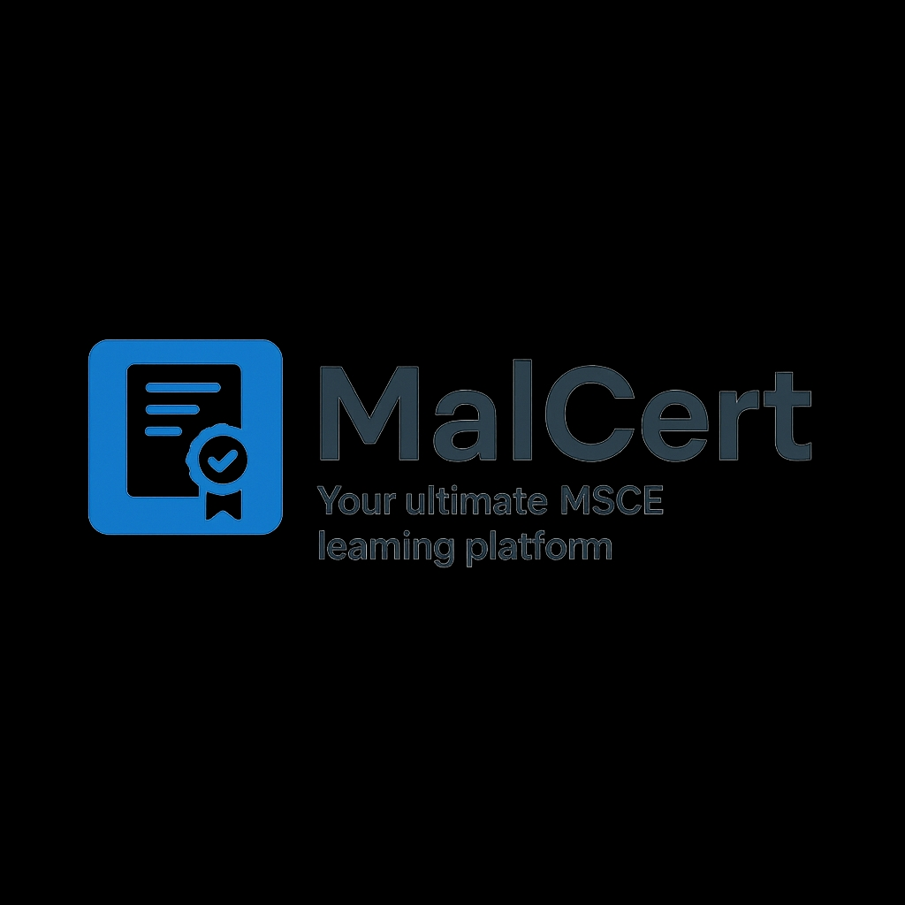

#  MalCert - MSCE Learning Platform

MalCert is a **web-based learning platform** designed to help Malawian students prepare for their MSCE exams. It provides a simple, mobile-friendly interface to access different subjects, register accounts, and track your learning progress.  

---

## 🌟 Features

- ✅ **User Registration & Login** – Secure sign-up and login with email and password.  
- ✅ **Welcome Page** – Personalized greeting for each student.  
- ✅ **Subjects Page** – Explore all MSCE subjects.  
- ✅ **Responsive Design** – Works beautifully on both mobile and desktop.  
- ✅ **Local Storage** – Saves users and sessions in the browser.  

---

## 🖥️ Live Demo

Click here to visit MalCert online:  
[🌐 Visit MalCert](https://donmeja.github.io/malcert/)  

---

## 📂 Project Structure
